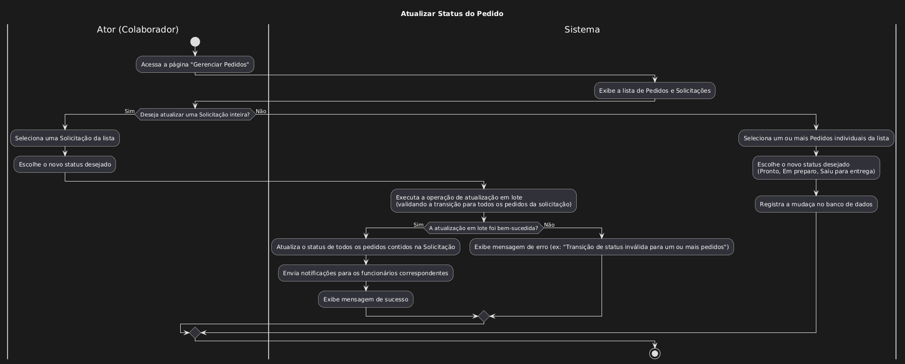

| Caso de uso         | Atualizar status do pedido                                                                                                                                                                                                                                                                                                                                                                                                                       |
| ------------------- | ------------------------------------------------------------------------------------------------------------------------------------------------------------------------------------------------------------------------------------------------------------------------------------------------------------------------------------------------------------------------------------------------------------------------------------------------ |
| Objetivo            | Atualizar o status de um pedido, para maior rastreabilidade do pedido                                                                                                                                                                                                                                                                                                                                                                            |
| Requisitos          | **RF101**                                                                                                                                                                                                                                                                                                                                                                                                                                        |
| Atores              | Colaborador do restaurante, Funcionário da construtora                                                                                                                                                                                                                                                                                                                                                                                           |
| Condição de entrada | O ator percebe que aconteceu uma mudança em relação ao estado do pedido. Exemplo: Pode ter saído para entrega, Pode ter sido recebido, Pode estar em preparo                                                                                                                                                                                                                                                                                     |
| Fluxo principal     | 1. O ator percebe que aconteceu uma mudança em relação ao estado pedido. 2. O ator vai até a pagina "Gerenciar pedidos" 3. O ator acessa a pagina de listagem de pedidos ou a pagina de listagem de solicitações[A1]. 4. O ator executa a [UC: Consultar Pedidos](especificacao_consultar_pedidos) que retorna um pedido. 5. E altera o pedido para o estado desejado.     - Pronto     - Em preparo 	- Saiu para a entrega |
| Fluxos alternativos | **A1 - Listagem de solicitação** 1. O ator executa a [UC : Consultar Solicitação](especificacao_consultar_solicitacao) 2.O ator atualiza o estado dessa Solicitação 3.O sistema atualiza todos os pedidos dessa solicitação para o novo estado                                                                                                                                                                                          |
