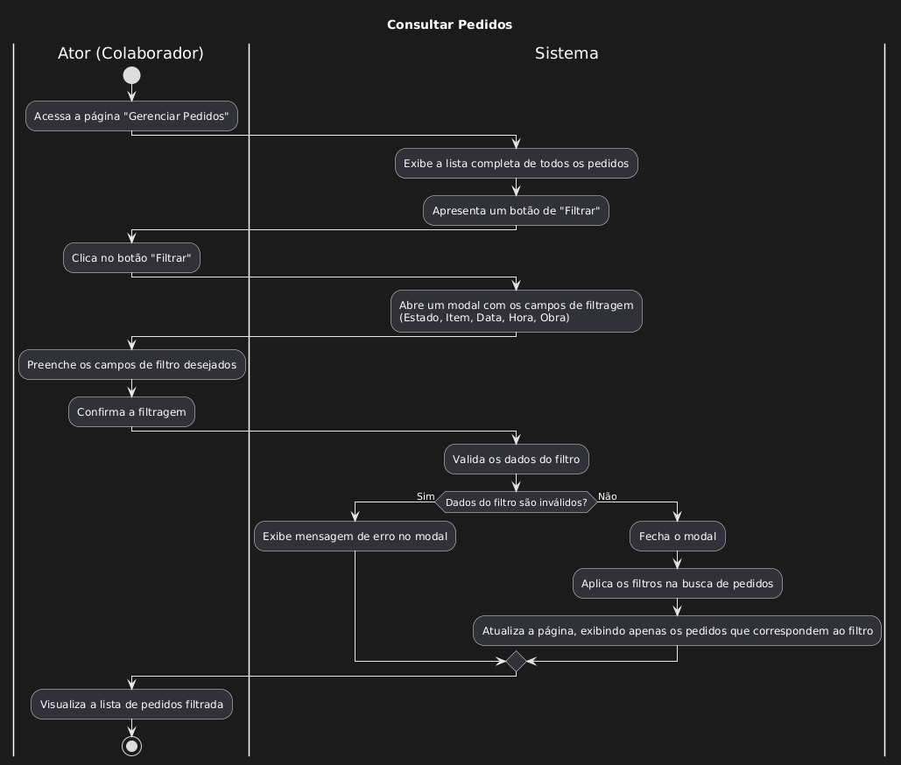

| Caso de uso         | UC08-Consultar Pedidos                                                                                                                                                                                                                                                                                                                                                                                                                                                                                                    |
| ------------------- | -------------------------------------------------------------------------------------------------------------------------------------------------------------------------------------------------------------------------------------------------------------------------------------------------------------------------------------------------------------------------------------------------------------------------------------------------------------------------------------------------------------------- |
| Objetivo            | Permitir que o ator consulte os pedidos gerados pelos funcionários da obra                                                                                                                                                                                                                                                                                                                                                                                                                                           |
| Requisitos          | **[RF126]**                                                                                                                                                                                                                                                                                                                                                                                                                                                                                                          |
| Atores              | Colaborador do restaurante                                                                                                                                                                                                                                                                                                                                                                                                                                                                                           |
| Condição de entrada | O ator acessa a pagina de Gerenciar Pedidos no menu lateral                                                                                                                                                                                                                                                                                                                                                                                                                                                          |
| Fluxo principal     | 1.O ator se depara com a pagina de listagem de pedidos 2.O ator percebe que existe um botão de filtro 3.O ator clica no botão de filtro 4.O sistema abre um modal, com alguns campos de filtragem:      - Estado  	- Item 	- Intervalo de Data 	- Intervalo de hora 	- Obra 5. O ator preenche os campos 6.O sistema valida os dados 7.O sistema retorna ele para a listagem 8.O ator percebe que todos os pedidos exibidos estão de acordo com o filtro que ele aplicou  |
| Fluxos de exceção   |                                                                                                                                                                                                                                                                                                                                                                                                                                               |
