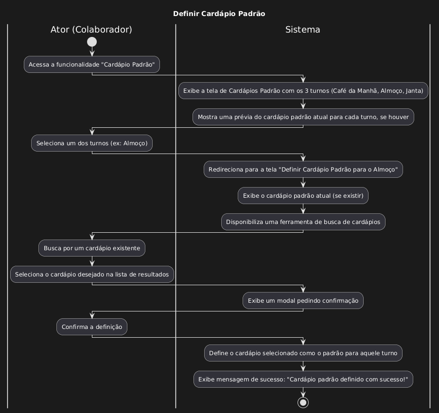

| Caso de uso         | UC10 - Definir Cardápio padrão                                                                                                                                                                                                                                                                                                                                                                                                                                                                                                                                                                                                                                                                                                                                                                                                                                                                                                                                                                                                                       |
| ------------------- | --------------------------------------------------------------------------------------------------------------------------------------------------------------------------------------------------------------------------------------------------------------------------------------------------------------------------------------------------------------------------------------------------------------------------------------------------------------------------------------------------------------------------------------------------------------------------------------------------------------------------------------------------------------------------------------------------------------------------------------------------------------------------------------------------------------------------------------------------------------------------------------------------------------------------------------------------------------------------------------------------------------------------------------------- |
| Objetivo            | Permitir que o ator defina um cardápio padrão a ser disponibilizado automaticamente pelo sistema                                                                                                                                                                                                                                                                                                                                                                                                                                                                                                                                                                                                                                                                                                                                                                                                                                                                                                                                              |
| Requisitos          | RF125                                                                                                                                                                                                                                                                                                                                                                                                                                                                                                                                                                                                                                                                                                                                                                                                                                                                                                                                                                                                                                         |
| Atores              | Colaborador do Restaurante                                                                                                                                                                                                                                                                                                                                                                                                                                                                                                                                                                                                                                                                                                                                                                                                                                                                                                                                                                                                                    |
| Condição de Entrada | O ator clica em Gerenciar cardápio                                                                                                                                                                                                                                                                                                                                                                                                                                                                                                                                                                                                                                                                                                                                                                                                                                                                                                                                                                                                            |
| Fluxo Principal     | 1.O ator acessa o botão "Cardápio Padrão" 2.O sistema o redireciona para a pagina de Cardápio Padrão 3.O ator percebe que existem 3 Cards.    - Texto "café da manhã", uma preview do Cardápio associado se existir    - Texto: "Almoço", uma preview do Cardápio associado se existir    - Texto: "Janta", uma preview do Cardápio associado se existir 4.O ator clica em uma dessas opções 5.O sistema redireciona para uma pagina com o titulo "Definir cardápio Padrão para..." o horário de refeição escolhido 6.Nessa pagina o ator ver o cardápio atual definido como padrão se tiver e um campo de Seleção de Cardápio, O ator também percebe que o cardápio padrão pode ser editado[A1] 7.O ator executa o fluxo alternativo A1 da [UC: Manter Cardápio](especificacao_manter_cardapios.md) 8.O ator seleciona o cardápio buscado 9.O sistema exibe um modal de confirmação 10.O ator confirma 11.O sistema define o esse cardápio como padrão 12. O sistema exibe uma mensagem de sucesso |
| Fluxo alternativo   | **A1 - Editar cardápio definido no cardápio padrão** 1.O ator executo o fluxo alternativo A2 da [UC: Manter Cardápio](especificacao_manter_cardapios)                                                                                                                                                                                                                                                                                                                                                                                                                                                                                                                                                                                                                                                                                                                                                                                                                                                                                      |
| Fluxo de Exceção    |                                                                                                                                                                                                                                                                                                                                                                                                                                                                                                                                                                                                                                                                                                                                                                                                                                                                                                                                                                                                                                               |
