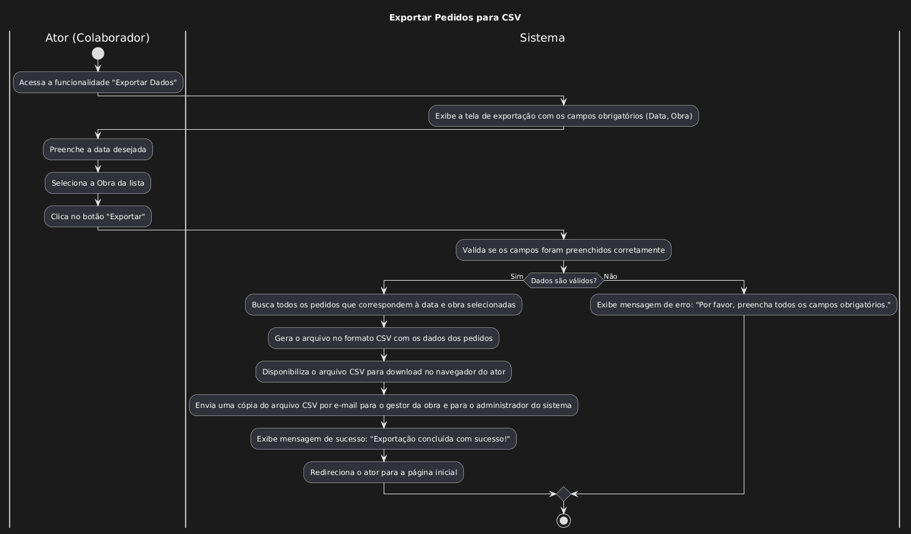

| Caso de uso         | UC15 - Exportar pedidos para CSV                                                                                                                                                                                                                                                                                                                                                                                                                                                                          |
| ------------------- | -------------------------------------------------------------------------------------------------------------------------------------------------------------------------------------------------------------------------------------------------------------------------------------------------------------------------------------------------------------------------------------------------------------------------------------------------------------------------------------------------- |
| Objetivo            | Exportar pedidos de um dia e de uma obra para CSV                                                                                                                                                                                                                                                                                                                                                                                                                                                  |
| Requisitos          | **[RF107]**                                                                                                                                                                                                                                                                                                                                                                                                                                                                                        |
| Atores              | Colaborador do restaurante                                                                                                                                                                                                                                                                                                                                                                                                                                                                         |
| Condição de entrada | O ator acessa Exportar Dados no menu lateral                                                                                                                                                                                                                                                                                                                                                                                                                                                       |
| Fluxo principal     | 1. O ator acessa Exportar Dados 2. O Ator se depara com dois campos obrigatórios para preencher e um botão       - Data 	  - Obra  	  - Botão: Exportar 3. O ator clica no botão Exportar com os dados preenchidos 4. O sistema faz o download do CSV para maquina do ator e manda uma cópia por e-mail desse arquivo para a obra escolhida e o administrador do sistema 5. O sistema redireciona o ator para a pagina de Inicio e mostra uma mensagem de sucesso na operação |

