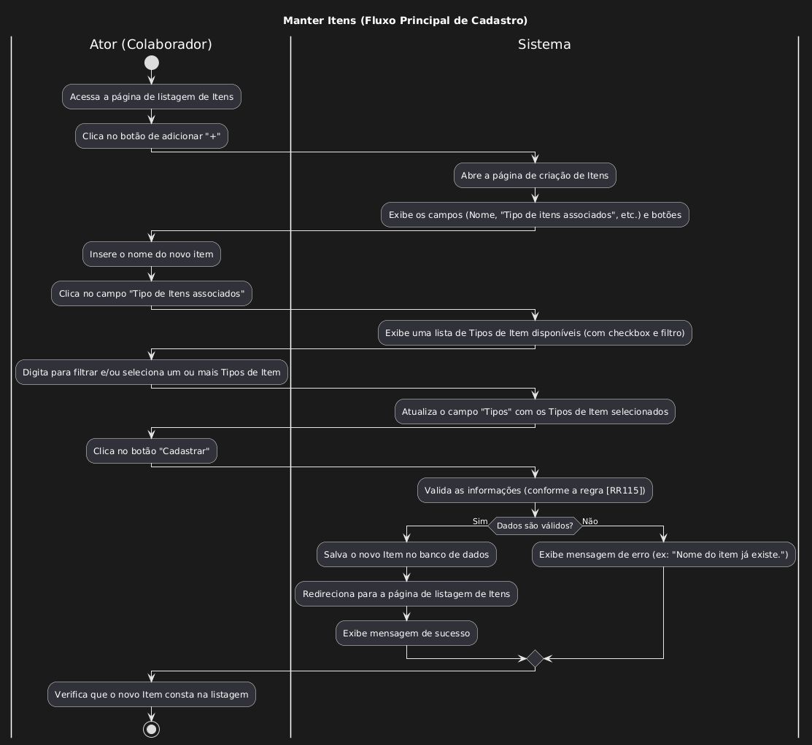

| Caso de uso         | UC26 - Manter Itens                                                                                                                                                                                                                                                                                                                                                                                                                                                                                                                                                                                                                                                                                                                                                                                                                                                                                                                                                                                                                                                                                                                                                                                                                                                                                                                                                                                                                     |
| ------------------- | -------------------------------------------------------------------------------------------------------------------------------------------------------------------------------------------------------------------------------------------------------------------------------------------------------------------------------------------------------------------------------------------------------------------------------------------------------------------------------------------------------------------------------------------------------------------------------------------------------------------------------------------------------------------------------------------------------------------------------------------------------------------------------------------------------------------------------------------------------------------------------------------------------------------------------------------------------------------------------------------------------------------------------------------------------------------------------------------------------------------------------------------------------------------------------------------------------------------------------------------------------------------------------------------------------------------------------------------------------------------------------------------------------------------------------- |
| Objetivo            | Permitir que o colaborador do restaurante efetue o cadastro, alteração, exclusão e consulta Itens                                                                                                                                                                                                                                                                                                                                                                                                                                                                                                                                                                                                                                                                                                                                                                                                                                                                                                                                                                                                                                                                                                                                                                                                                                                                                                                                |
| Requisitos          | **[RF120]**,**[RF124]**                                                                                                                                                                                                                                                                                                                                                                                                                                                                                                                                                                                                                                                                                                                                                                                                                                                                                                                                                                                                                                                                                                                                                                                                                                                                                                                                                                                                          |
| Atores              | Colaborador do restaurante                                                                                                                                                                                                                                                                                                                                                                                                                                                                                                                                                                                                                                                                                                                                                                                                                                                                                                                                                                                                                                                                                                                                                                                                                                                                                                                                                                                                       |
| Condição de entrada | O ator seleciona Catalogo no menu lateral abre-se outras opção e então clica em "Itens"                                                                                                                                                                                                                                                                                                                                                                                                                                                                                                                                                                                                                                                                                                                                                                                                                                                                                                                                                                                                                                                                                                                                                                                                                                                                                                                                          |
| Fluxo principal     | 1.O ator se depara com uma lista de Itens e percebe que existe              - Um botão de adicionar "+",       - Um botão de filtragem [A1]       - Um botão de deletar quando passa sobre um Item[A3] 	  - Um botão de Editar quando passa sobre um Item[A2] 2.O ator clica no botão de adicionar e se abre uma página de criação de Itens. 3.O ator percebe que existe 2 campos que podem ser preenchidos e um terceiro com os Tipos item desse Item no momento percebe que esta sem nenhum    - Nome    - Tipo de itens associados    - Tipos     - Botão de Cancelar    - Botão de Confirmar 4.O ator insere um nome qualquer 5.O ator quando clicou na parte de "Tipo de Itens associados" abriu um checkbox com todos os Tipos de itens, quando ele digitava ele filtrava os Tipos de Itens 6.O ator quando ele clica em uma das opções ele percebe que no terceiro campo ele se atualiza mostrando o Tipo de item. 7.O ator após preencher os campos aperta em Cadastrar 8.O sistema válida as informações [RN115] 9.O sistema redireciona para a pagina de listagem de Item 10.O ator percebe que seu Item recém criado está dentro da listagem pelo seu nome                                                                                                                                                                                                      |
| Fluxos alternativos | **A1 - Buscar Item** 1.O sistema abre um modal com uns campos a serem preenchidos nome e Tipo de Itens 2.O ator necessita realizar uma busca de Item. Ele decidi buscar por nome e pelos Tipos de Item dentro do Item 3.O ator digita o nome e seleciona alguns Tipos de item e clica no botão Buscar no canto inferior do modal 4.O sistema atualiza a listagem com todos os Itens que coRNespondem os termos digitados e selecionados  **A2 - Editar Item** 1.O sistema abre um modal com os campos já preenchidos com as informações do Item 2.O ator decide mudar o nome do Item e decide remover um dos seus Tipos. Para remover o ator apenas clica sobre o Tipo do item no campo de "Tipos" 3.O ator aperta em salvar no canto inferior do modal 4.O sistema valida os dados [RN115]  5.O sistema salva os dados 7.O sistema mostra uma mensagem de sucesso e o redireciona para a tela de listagem 8.O ator percebe que o novo nome que ele colocou foi persistido e sua remoção de Tipo também  **A3 - Excluir Item** 1.O sistema abre um modal de confirmação, perguntando se realmente quer excluir 2.O ator confirma a exclusão 3.O sistema atualiza a listagem 4.O sistema exibe uma mensagem de sucesso 5.O sistema redireciona para a tela de listagem de Itens 6.O ator percebe que o Item que ele acabou de excluir não esta na listagem   |
| Fluxos de exceção   | [RN115] - Não pode existir Itens com nomes iguais                                                                                                                                                                                                                                                                                                                                                                                                                                                                                                                                                                                                                                                                                                                                                                                                                                                                                                                                                                                                                                                                                                                                                                                                                                                                                                                                                                                |

