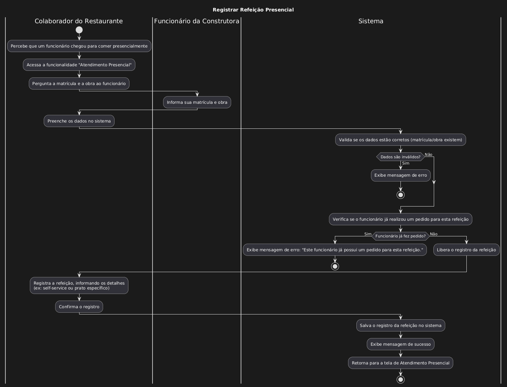

| Caso de uso         | Registrar refeição presencial                                                                                                                                                                                                                                                                                                                                                                                                                                                                                                                                                                                                                                                                                                                                                                                                                                                                                                         |
| ------------------- | ------------------------------------------------------------------------------------------------------------------------------------------------------------------------------------------------------------------------------------------------------------------------------------------------------------------------------------------------------------------------------------------------------------------------------------------------------------------------------------------------------------------------------------------------------------------------------------------------------------------------------------------------------------------------------------------------------------------------------------------------------------------------------------------------------------------------------------------------------------------------------------------------------------------------------------- |
| Objetivo            | Registrar a refeição do funcionário da obra, no caso dele comer presencialmente                                                                                                                                                                                                                                                                                                                                                                                                                                                                                                                                                                                                                                                                                                                                                                                                                                                       |
| Requisitos          | RF011, RF104, RF110                                                                                                                                                                                                                                                                                                                                                                                                                                                                                                                                                                                                                                                                                                                                                                                                                                                                                                                   |
| Atores              | Colaborador do restaurante, Funcionário da construtora                                                                                                                                                                                                                                                                                                                                                                                                                                                                                                                                                                                                                                                                                                                                                                                                                                                                                |
| Condição de entrada | O Funcionário da obra decide comer no restaurante                                                                                                                                                                                                                                                                                                                                                                                                                                                                                                                                                                                                                                                                                                                                                                                                                                                                                     |
| Fluxo principal     | 1. O colaborador do restaurante percebe que um funcionário da obra veio almoçar presencialmente  2. O colaborador do restaurante na página principal do sistema percebe a opção "Atendimento Presencial ", ele acessa. 3. O colaborador do restaurante ele pergunta a matricula e sua obra 4. O Funcionário da construtora responde 5. O colaborador do restaurante preenche os dados 6.O sistema valida se os dados estão corretos e se o Funcionário da construtora já fez o pedido daquela refeição[RNF107] 7. O colaborador da obra registra uma refeição associado a esse funcionário da construtora e preenche as seguintes informações:      - se é self-service 	 - se não for ele preenche o prato que ele pediu 8. O colaborador do restaurante após concluir a ação é levado de volta para a pagina de Atendimento presencial, e o sistema mostra na tela uma mensagem de sucesso 	    |
| Fluxos alternativos | ** A1 - O Funcionário da construtora não está com celular** 1-O sistema checará se o funcionário da construtora indicado se ele ja fez um pedido daquela refeição, se não o sistema libera para o funcionário da construtora fazer a refeição                                                                                                                                                                                                                                                                                                                                                                                                                                                                                                                                                                                                                                                                                      |
| Fluxos de exceção   | **RNF107** - Um funcionário da construtora só pode fazer um pedido por refeição                                                                                                                                                                                                                                                                                                                                                                                                                                                                                                                                                                                                                                                                                                                                                                                                                                                       |

