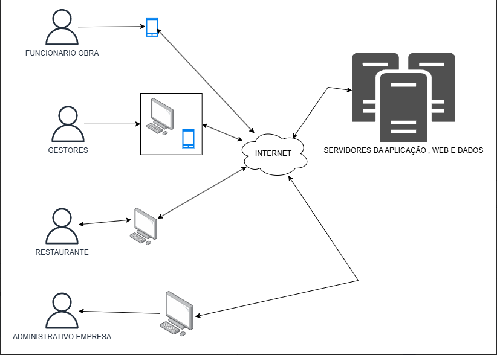

<h1>Visão do Produto</h1>

<h2>Conecta Refeições</h2>

<small>Versão 1.1</small>

---

## Histórico de revisões

|    Data    | Versão |           Descrição           |      Autor       |
| :--------: | :----: | :---------------------------: | :--------------: |
| 26/05/2025 |  1.0   |     Criação do documento      | Andrey Vasconcelos, João Pedro Rodrigues, Lucas Emanuel Araujo, Pedro Arthur de Holanda |
| 06/06/2025 |  1.1   | Correção de informações | Andrey Vasconcelos, João Pedro Rodrigues |

---
# Introdução

O documento de Visão do Produto (DVP) é um documento que descreve o produto de software que será desenvolvido. Ele descreve o problema que será resolvido, as principais necessidades dos stakeholders, as principais funcionalidades do sistema, as restrições do projeto, etc.

# Propósito
<!--  -->
O objetivo deste documento é coletar, analisar e definir características e as necessidades de alto nível do Sistema Conecta Refeições.

Ele se concentra nos recursos necessários aos stakeholders e aos usuários, e nas razões que levam a essas necessidades.

Os detalhes de como o Sistema Conecta Refeições atingem essas necessidades são descritos nas especificações de casos de uso e nos requisitos funcionais.

# Abreviações

| Termo | Definição |
| :---: | :---- |
| DVP | Documento de Visão do Produto |
| NFe | Nota Fiscal Eletrônica |
| NFSe | Nota Fiscal de Serviços Eletrônica |
| SRS | Especificação de Requisitos de Software |
| UML | Linguagem de Modelagem Unificada |
| API | Interface de Programação de Aplicações |

# Definições

| Termo | Definição |
| :---: | :---- |
| Cliente | É uma pessoa física ou jurídica que compra um produto ou contrata um serviço. |
| Consumidor | É uma pessoa física que compra um produto ou contrata um serviço. |
| Empresa | É uma pessoa jurídica que compra um produto ou contrata um serviço. |
| Fornecedor | É uma pessoa física ou jurídica que vende um produto ou presta um serviço. |
| Nota Fiscal | É um documento fiscal que ateste a compra de um produto ou serviço. |
| Produto | É um bem ou serviço que é vendido ou prestado. |
| Serviço | É um bem intangível que é prestado. |
| Canteiro de Obras | Local onde está ocorrendo de fato a construção realizada pela Construtora |
| Espelho | Folha utilizada para coletar as assinaturas dos funcionários que pegaram uma refeição |
| Servente | Funcionário que trabalha dentro do canteiro de obras, realizando a construção |
| Gestor de Obras | Responsável por fazer a gestão dentro do Canteiro de Obras, passando possíveis demandas para o setor administrativo |
| Administrador de Obra | Responsável pelo controle de gastos da obra, dar permissão para a compra de materiais para a obra e contatar fornecedores. |
| Nuvem | Serviços de armazenamento na internet |

# Escopo do Produto

O Sistema Conecta Refeições é uma aplicação que visa digitalizar o processo de solicitação e controle de refeições em obras. Permite que colaboradores façam pedidos via celular, que restaurantes recebam e registrem os pedidos, e que gestores acompanhem os dados. O sistema reduz erros e economiza tempo.

# Posicionamento

# Oportunidade de Negócios

O sistema Conecta Refeições apresenta diversas oportunidades de negócios, tais como:

### **1\. Parcerias com restaurantes locais:**

Integrar restaurantes parceiros na plataforma para que recebam pedidos direto por lá, oferecendo mais visibilidade e benefícios para quem entrar no sistema e ajudando a criar uma rede de alimentação voltada para obras.

### **2\. Expansão para outros setores:**

Adaptar o sistema para empresas de outros segmentos que também oferecem refeições aos seus colaboradores, como indústrias, mineradoras, eventos e escolas, aproveitando a mesma lógica de operação com ajustes pontuais.

### **3\. Módulo de auditoria:**

Adicionar funções que permitam acompanhar todas as etapas do pedido (quem fez, quando, onde e qual refeição), criando um histórico para evitar fraudes e facilitar a prestação de contas com fornecedores e gestores a fim de evitar desperdício orçamental.

### **4\. Marketplace de Serviços Complementares**

### Criar um marketplace dentro da plataforma, onde além dos restaurantes, outros serviços possam ser oferecidos para obras, como fornecedores de marmitas, lanches rápidos, cafés, bebidas e até serviços de logística (entrega nas obras).

### 

### **5\. Integração com outras ferramentas**

Oferecer uma API pública que permite integrar o Conecta Refeições com outros softwares, como ERPs, sistemas de gestão de obra, CRMs e aplicativos de comunicação, como WhatsApp e Telegram.

# Descrição dos benefícios 

| Benefícios | Problemas resolvidos  | Afetados |
| :---- | :---- | :---- |
| Automatização dos processos de pedidos  | Todas as partes do processo são feitas manualmente.  | Todos os envolvidos na obra de uma maneira geral.  Os funcionários que pedem a refeição, os gestores, o restaurante que recebe os pedidos  |
| Comunicação entre obra e restaurante facilitada por meios digitais | Problemas de discrepância entre a quantidade de refeições que a construtora registrou ter pedido, com a quantidade de refeições que o restaurante registrou ter  sido pedidos.  | Restaurante e Empresa |
| Integração com ferramentas já usadas na empresa.  | Passar todos os pedidos manualmente para uma planilha do Excel, que é feito manualmente. | Funcionários da obra como gestores de obra e administrador |
| Reduzir chances de erros | Garantir que não seja feito pedidos errados ;  | Todos os envolvidos na obra de uma maneira geral.  Os funcionários que pedem a refeição, os gestores, o restaurante que recebe os pedidos  |

# Descrição dos stakeholders e dos usuários

| Stakeholder | Descrição | Papel |
| ----- | ----- | ----- |
| Construtora | Empresa responsável pela obra que deseja otimizar o processo de solicitação e controle de refeições para seus colaboradores. | Contrata e utiliza o sistema |
| Restaurante | Restaurante que vai ser integrado a aplicação e vai ofertar as refeições | Utiliza e é um dos beneficiados do desenvolvimento do sistema, já que os pedidos serão passados e validados por eles  |
| Equipe de Suporte e Desenvolvimento | Profissionais técnicos responsáveis pela manutenção, atualização e suporte do sistema | Garantem que a plataforma funcione sem interrupções, resolvem problemas técnicos e fazem melhorias e atualizações sempre que necessário |
|Colaborador da obra | Colaboradores que trabalham na obra, tanto no escritorio quanto na obra  | Utiliza e é um beneficiados do desenvolvimento do sistema, visto que vai começar a fazer os pedidos pelo sistema, garantindo que tenha menos erros na obra e na hora de confirmar o pedido 
|Colaborador do restaurante | Trabalhadores do restaurante que vão confirmar o pedidos dos colaboradores da obra | Utiliza o sistema para validar os pedidos e enviaram e confirmarem as saídas dos pedidos 
|Gestor da obra |Colaborador da obra que é responsável por gerir a obra|  Monitoram os pedidos feitos, gerenciam a distribuição das refeições e conferem os relatórios
|||
# Usuários e atores

| Usuário | Descrição | Responsabilidades | Stakeholders |
| ----- | ----- | ----- | ----- |
| Colaborador da obra | Funcionários que atuam diretamente nas obras e realizam os pedidos de refeições pelo aplicativo. | Utilizam o sistema para escolher e solicitar suas refeições | Construtura, Colaborador da obra  |
| Colaborador do restaurante | Funcionário dos restaurantes que recebem e processam os pedidos feitos pelos colaboradores. | Recebem, confirmam e registram os pedidos | Restaurante, Colaborador do restaurante |
| Gestores de Obras | Profissionais responsáveis pelo acompanhamento da obra, controle de pedidos entre outras funções | Monitoram os pedidos feitos, gerenciam a distribuição das refeições e conferem os relatórios | Construtora, Gestor da obra |
| Administrador | Usuário administrativo com permissões totais para configurar, gerenciar e auditar o sistema. | Cadastram os dados das assinaturas no sistema, faz a gestão de usuarios, e no geral gerencia o sistema  | Construtora |
|  |  |  |  |

# Descrição do ambiente de uso

## Ambiente de uso

### Ambiente dos Colaboradores da obra:
Neste ambiente, o sistema é utilizado pelos colaboradores das obras para realizar os pedidos de refeições. Eles acessam o sistema principalmente por meio de dispositivos móveis, como smartphones e tablets, utilizando os sistemas operacionais se for Android 11 de 2020 ou maior , e se for IOS versão 15 de 2021 ou superior. 

### Ambiente do Restaurante Parceiro:  
Neste ambiente, o sistema é utilizado pelos funcionários dos restaurantes que recebem e processam os pedidos feitos pelos colaboradores. O acesso ocorre de preferência por computadores, permitindo a visualização, confirmação e registro dos pedidos em tempo real, sendo disponibilizado nos seguintes navegadores Google Chrome, Microsoft Edge, Firefox e Opera . 

### Ambiente Administrativo da Construtora:  
Aqui, o sistema é usado pela equipe administrativa responsável por controlar e gerenciar os pedidos de refeições das obras. Eles acessam principalmente pelo computador para gerar relatórios, analisar dados e integrar informações com planilhas virtuais, como Excel e GoogleSpreadSheet. O ambiente conta com acesso restrito para garantir a segurança e a confidencialidade dos dados.O sistema sera acessado com um site na WEB, sendo disponibilizado nos seguintes navegadores oogle Chrome, Microsoft Edge, Firefox e Opera.

### Ambiente de Suporte e Desenvolvimento:  
Neste ambiente é onde será desenvolvido o código fonte do sistema.A equipe de desenvolvimento operará em ambientes controlados e restritos , o ambiente deve suportar 
o git como principal ferramenta de controle de versão, contará com um ambiente de testes dedicado, o ambiente também deve possuir uma implementação de ferramentas de Integração continua e Entrega continua para agilizar processos de build, teste e implantatação.

# Necessidades principais quanto ao ambiente

| Necessidade | Prioridade | Interesse | Solução atual | Solução proposta |
| :---- | :---- | :---- | :---- | :---- |
|  **Qualidade:** O sistema deve sempre estar disponível, livre de erros , deve ter uma integração com banco de dados com o fito de analisar os dados. Integração com excel, pois os colaboradores já estão acostumados. | ALTA | Os clientes esperam que o sistema seja capaz de gerenciar mais efetivamente os pedidos e que possa garantir que não haja erro na contagem de pedidos e das refeições entregues. Os clientes desejam que o sistema esteja sempre disponível | Um gestor se encarrega de gerenciar , anotar todos os pedidos e confirmar com os colaboradores se receberam o pedido. | Por meio de uma aplicação os funcionários podem pedir diretamente com o restaurante, confirmar o recebimento do pedido e etc, |
| **Desempenho:** A aplicação deve ter um tempo de resposta rápido.Ser bastante otimizado para suportar dispositivos com poder computacional limitado.  As requisições devem ser atendidas em menos de 2 segundos. O software deve conseguir aguentar diversas requisições ao mesmo tempo ,visto que os usuários vão provavelmente usar ao mesmo tempo nos horário de refeições.  | ALTA | Os clientes querem que o sistema seja capaz de aguentar todas requisições feitas em horários de pico , além disso querem que a aplicação seja otimizada para atender a todo tipo de dispositivo.Essas requisições seriam os pedidos , confirmação dos pedidos e etc.  | N/A | Por meio da aplicação os colaboradores podem pedir.  |
| **Escalabilidade:** A aplicação deve ser capaz de suportar o crescimento no número de empresas parceiras e funcionários. | MODERADA | O cliente deseja que, não importando o número dos colaboradores e empresas parceiras , a aplicação continue funcionando normalmente.  | De acordo com a expansão da obra, a construtora pode contratar auxiliares para o gestor, ou mais de um gestor para a obra. | Implementar medidas de armazenamento em nuvem, otimizar os processos de pedidos para garantir escalabilidade. |
| **Segurança:** O sistema deve ser seguro, protegido contra acesso não autorizado, invasões e roubo de dados | MODERADA | Os clientes esperam que informações pessoais dos seus colaboradores estejam seguras. O cliente espera que diminua as fraudes de pedidos que muitas vezes são feitas por outras pessoas.   | Os administradores registram as notas fiscais e checam manualmente os pedidos, o'que demanda tempo e pode provocar erros  | Implementar medidas criptográficas e de autenticação para garantir que o pedido chegue na pessoa que pediu com o maior sigilo possível e garantir que não haja fraudes. |
| **Usabilidade**: O sistema deve ser fácil de usar e entender, com uma interface intuitiva e amigável ao usuário. | ALTA | Os clientes enfatizaram a importância do sistema ser fácil de usar e que muito efetivo no uso sendo necessário poucos passos para concluir qualquer tarefa. | N/A. Não tem sistema ainda | Implementar telas que sejam acessíveis a maioria do público alvo. Para garantir isso será necessário realizarmos testes de usabilidade com usuários reais , e ir melhorando a interface |

# Visão geral do produto

O sistema de controle de pedidos de refeição foi desenvolvido para automatizar o processo de solicitação de refeições por colaboradores em obras da construção civil. Ele substitui planilhas manuais por uma plataforma digital acessível via celular ou navegador, permitindo que colaboradores façam pedidos com facilidade, restaurantes recebam as informações organizadas e o setor administrativo tenha relatórios e exportações para controle interno.

A solução oferece níveis de acesso personalizados para cada perfil (colaborador, restaurante, administrador), promovendo eficiência, rastreabilidade e transparência em toda a cadeia do processo.

*__Figura 1__ - Arquitetura ambiental do sistema Conecta refeições*

# Custo e venda

 O custeamento para o desenvolvimento desse projeto será proveniente da Construtora, a qual requisitou a construção do sistema e terá participação na apuração das regras de negócio do projeto. Futuramente, o sistema também pode ser adaptado para contextos gerais, e ter sua licença disponibilizada para venda no mercado para potenciais clientes. Nesse caso, a Construtora que solicitou o projeto terá descontos para compra da licença, mas o valor obtido com as vendas da licença para outros clientes irá para a empresa desenvolvedora do sofware

# Licenciamento e instalação

O sistema Conecta Refeições será licenciado por meio de uma licença de uso corporativa, fornecida pela empresa desenvolvedora do software. A licença concederá à construtora o direito de utilizar o sistema com suporte para centenas de usuários, conforme escopo definido em contrato.

O Conecta Refeições poderá ser instalado localmente nos servidores da construtora ou em ambiente de nuvem fornecido pela equipe de desenvolvimento , cobrando uma assinatura anual. A instalação poderá ser realizada pela equipe técnica da própria construtora ou, alternativamente, pela equipe da empresa desenvolvedora mediante contratação de serviço adicional.

A empresa desenvolvedora será responsável por fornecer o pacote de instalação, manuais técnicos e instruções detalhadas para configuração do sistema e da base de dados. Após a conclusão da instalação, serão disponibilizadas credenciais de acesso administrativo para uso pleno do sistema.

As atualizações corretivas, voltadas à resolução de bugs eventualmente identificados pelos usuários, poderão ser solicitadas diretamente à equipe de suporte técnico. Essas atualizações serão analisadas e implementadas conforme cronograma acordado, garantindo o bom funcionamento e a estabilidade do sistema.

A propriedade intelectual do Conecta Refeições permanecerá integralmente com a empresa desenvolvedora. A construtora será licenciada para uso do sistema, nos limites estabelecidos contratualmente. Qualquer uso não autorizado, como cópias indevidas, distribuição ou sublicenciamento, constituirá infração contratual e estará sujeito às sanções legais aplicáveis.

# Características e funcionalidades de alto nível

1 \- Cadastro e autenticação de usuários  
O sistema permite o cadastro e login de diferentes tipos de usuários: colaboradores, administradores e restaurantes. Cada perfil terá permissões específicas, garantindo segurança e controle de acesso.

2 \- Solicitar refeição  
Permite que o colaborador faça seu pedido de refeição de forma simples e rápida, com validações que garantem que o pedido seja feito dentro do prazo estipulado pelo restaurante.

3 \- Visualização e gerenciamento de pedidos  
Restaurantes têm acesso aos pedidos recebidos por dia e por obra, podendo visualizar e organizar a produção e entrega das refeições com base nas solicitações recebidas.

4 \- Relatórios administrativos  
Administradores podem gerar relatórios detalhados com filtros por obra, data e restaurante. Esses relatórios ajudam no controle de consumo e planejamento

5 \- Exportação de dados  
O sistema oferece a funcionalidade de exportar os dados de pedidos para o Excel, permitindo maior integração com processos internos da empresa.

# Restrições

1\.**Restrição de tempo**: O sistema deve ser produzido dentro de um prazo de 18 meses, com entregas incrementais a cada 2 semanas de seguindo metodologias ágeis
 
2\. **Restrições de hardware**:O sistema deve ser otimizado o suficiente para funcionar em smartphones com a versão operacional se for Android 11 de 2020 ou maior , e se for IOS versão 15 de 2021 ou superior.Para ambientes que desejam fazer a instalação deve ser necessario Windowns 11 

3\. **Restrições de segurança e privacidade**: O sistema deve atender aos requisitos de segurança, privacidade e proteção de dados do usuário, conforme a Lei Geral de Proteção de Dados (LGPD), visto que estaremos usando dados dos colaboradores das empresas.  

4\. **Restrições de interface**: O sistema deve permitir que os colaboradores concluam a solicitação de refeição em poucos passos, com interface conversacional para os colaboradores da obra (texto para áudio e áudio para texto, para uma fase posterior) e ícones grandes para facilitar a usabilidade em campo.

5\. **Restrições de interoperabilidade**: O sistema tem que possuir uma integração com aplicações de planilhas como Excel e Google SpreadSheet e futuramente com o Whatsapp em uma fase posterior.  

6\. **Restrições de desempenho**:O sistema dever ser capaz inicialmente de processar simultaneamente 500 a 1000 requisições de pedidos e confirmação sem uma degradação perceptivel, mantendo o tempo de resposta abaixo de 5 segundos 

7\.**Restrições de linguagem**: O sistema deve ser compatível com os idiomas inglês e português.

